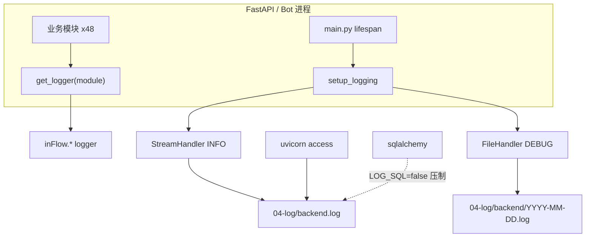

# inFlow AI 日志系统重构方案

> **文档版本**：v1.0  
> **日期**：2026-06-23  
> **状态**：第一期已实施（2026-06-23）
> **范围**：第一期 — 后端 + 微信 bot（前端暂不动）

---

## 一、已确认决策

| # | 议题 | 决策 |
|---|------|------|
| 1 | 日志目录结构 | **方案 A**：业务日志写入 `04-log/backend/YYYY-MM-DD.log`；保留 `04-log/backend.log` 作为 uvicorn 原始 stdout 重定向 |
| 2 | 默认噪音控制 | SQL 日志默认关（`LOG_SQL=false`）；Access 日志默认关（`LOG_ACCESS=false`） |
| 3 | 实施范围 | 第一期仅后端 + 微信 bot，前端保持现状 |
| 4 | 参考实现迁移 | 将 `06-src/utils/logger.py` 适配迁移至 `03-src/backend/app/core/utils/logger.py` |
| 5 | 本次交付 | 先落地方案文档，代码实施待下一轮确认后执行 |

---

## 二、现状诊断

### 2.1 日志落盘方式

`start-local.sh` 通过 `nohup ... > 04-log/backend.log 2>&1` 将进程 stdout/stderr 重定向到单个文件，无按日切分、无大小轮转。

| 文件 | 内容来源 | 主要问题 |
|------|----------|----------|
| `04-log/backend.log` | uvicorn + SQLAlchemy + 少量业务日志 | 单文件持续增长，有效信息占比极低 |
| `04-log/frontend.log` | Next.js dev 输出 | 无结构化，仅编译/请求行 |
| `04-log/wechat-bot.log` | 微信 bot 独立进程 | SQL 日志重复打印 |

### 2.2 格式混杂（至少 4 种）

**① Uvicorn 访问日志**（轮询噪音）

```
INFO:     127.0.0.1:65004 - "GET /api/ingest/jobs HTTP/1.1" 200 OK
```

样本统计：`GET /api/ingest/jobs` 约 152 次/单次启动周期（前端轮询）。

**② SQLAlchemy**（最大噪音源）

```
2026-06-23 20:37:52,295 INFO sqlalchemy.engine.Engine select pg_catalog.version()
```

样本统计：约 3030 行 / 5748 行 ≈ **53%**。  
根因：`database.py` 中 `echo=settings.debug`，而 `config.py` 默认 `debug=True`。

**③ 仅 main.py 手动配置的业务日志**

```
2026-06-23 20:37:52,512 [inFlow.auto_backfill] INFO: Auto-backfill background task started
```

**④ 微信 bot 的 basicConfig + SQL 双份输出**

```
2026-06-23 20:37:59,439 INFO sqlalchemy.engine.Engine select ...
2026-06-23 20:37:59,439 [sqlalchemy.engine.Engine] INFO: select ...
```

### 2.3 关键缺陷：业务日志写了但未落盘

全项目约 **48 个文件**使用 `logging.getLogger(...)`，但：

- 仅 `main.py` 的 `inFlow.auto_backfill` 和 `wechat/bot.py` 的 `basicConfig` 配置了 handler
- 其余 logger 默认 `propagate=True`，root logger 在 uvicorn 下级别偏高
- **INFO 级业务日志被静默丢弃**

实证：`orchestrator.py` 中有完整 ingest 链路日志（`ingest_url queued`、`Parse step complete` 等），在 `04-log/` 中**搜不到任何一条**；`inFlow.*` 业务行仅约 30 行 / 5748 行。

### 2.4 命名不一致

| 写法 | 示例 | 数量 |
|------|------|------|
| `inFlow.xxx` | `inFlow.ingest.orchestrator` | 多数业务模块 |
| `__name__` | `app.s1_ingest.orchestrator` | 部分 core/router |
| `print()` | `main.py`、`database.py` | 启动/迁移提示 |

---

## 三、目标架构

### 3.1 目录结构（方案 A）

```
04-log/
├── backend.log              # uvicorn 原始 stdout（start-local.sh 重定向，保留）
├── backend/
│   └── 2026-06-23.log       # 业务结构化日志（后端 + 微信 bot，按日切分）
├── frontend.log             # 不变
└── wechat-bot.log           # bot 进程原始 stdout（保留，无按日业务文件）
```

### 3.2 统一日志格式

对标 `06-src/utils/logger.py`，输出格式：

```
%(asctime)s | %(levelname)-8s | %(name)s | %(message)s
```

示例：

```
2026-06-23 20:45:30 | INFO     | ingest.orchestrator   | ingest_url queued: job=abc platform=xiaoyuzhou url=https://...
2026-06-23 20:45:35 | INFO     | ingest.orchestrator   | URL capture complete: job=abc path=raw/...
2026-06-23 20:45:40 | INFO     | parse.parser          | Parse step complete: job=abc
2026-06-23 20:45:42 | ERROR    | auto_backfill         | embedding failed: Local embedding model not available
```

模块名显示时去掉 `inFlow.` 前缀（参考 `_PodcastMapFormatter` 逻辑，根名改为 `inFlow`）。

### 3.3 双通道输出

| 通道 | 级别 | 用途 |
|------|------|------|
| StreamHandler（stdout） | INFO | 终端 / `backend.log` 重定向可见 |
| FileHandler（按日文件） | DEBUG | `04-log/backend/YYYY-MM-DD.log` 详细排查 |

### 3.4 架构示意



---

## 四、第一期实施清单

### 4.1 新增文件

#### `03-src/backend/app/core/utils/logger.py`

从 `06-src/utils/logger.py` 迁移并适配：

| 原实现 | inFlow 适配 |
|--------|------------|
| `_ROOT_LOGGER_NAME = "podcastmap"` | `_ROOT_LOGGER_NAME = "inFlow"` |
| `setup_logger(log_dir="log")` | `setup_logging(log_dir=settings.log_dir)` |
| `_PodcastMapFormatter` | `_inFlowFormatter`（去掉 `inFlow.` 前缀） |
| — | 新增 `configure_third_party_loggers()` 压制 SQL/httpx/uvicorn |

核心 API：

```python
def setup_logging(
    log_dir: str | Path,
    stream_level: int = logging.INFO,
    file_level: int = logging.DEBUG,
) -> logging.Logger: ...

def get_logger(module_name: str) -> logging.Logger:
    """返回 inFlow.<module_name> logger"""
    ...

def configure_third_party_loggers(
    log_sql: bool = False,
    log_access: bool = False,
) -> None: ...
```

#### `03-src/backend/app/core/uvicorn_log_config.json`（可选）

用于 `--log-config` 控制 uvicorn 格式；access log 可通过 Filter 跳过高频路径。

### 4.2 修改文件

| 文件 | 改动 |
|------|------|
| `app/core/config.py` | 新增 `log_dir`、`log_level`、`log_sql`、`log_access`、`log_access_skip`；`debug` 与 SQL echo 解耦 |
| `app/core/database.py` | `echo=settings.log_sql`（不再绑定 `debug`）；`print` 迁移警告改为 `logger.warning` |
| `app/main.py` | lifespan 开头调用 `setup_logging()`；删除手写 `inFlow.auto_backfill` handler；`print` 改 `logger.info` |
| `app/extensions/wechat/bot.py` | 删除 `logging.basicConfig`；启动时调用 `setup_logging()`（与后端共用 `LOG_DIR`） |
| `start-local.sh` | 传递 `LOG_*` 环境变量；uvicorn 加 `--log-config`（若采用）；启动提示中补充业务日志路径 |
| `.env` / `.env.example` | 补充日志相关变量说明 |

### 4.3 暂不改动（第二期渐进）

- 48 个业务文件中 `getLogger(__name__)` → `get_logger("ingest.orchestrator")` 的批量替换
- 请求追踪 ID（`contextvars` + 中间件）
- `RotatingFileHandler` 大小轮转
- 前端日志结构化
- `scripts/logs.sh` 查看辅助脚本

---

## 五、环境变量

在 `.env` 中新增（建议默认值）：

```bash
# ── 日志 ─────────────────────────────────────────────────
# 业务结构化日志目录（按日落盘：LOG_DIR/YYYY-MM-DD.log）
LOG_DIR=04-log/backend

# 业务日志级别：DEBUG | INFO | WARNING | ERROR
LOG_LEVEL=INFO

# 是否输出 SQL 语句（默认关，排查数据库问题时开）
LOG_SQL=false

# 是否输出 HTTP 访问日志（默认关，排查接口问题时开）
LOG_ACCESS=false

# 访问日志跳过的路径（逗号分隔，减少轮询噪音）
LOG_ACCESS_SKIP=/api/ingest/jobs,/api/health
```

微信 bot 与后端共用 `LOG_DIR=04-log/backend`，业务日志写入同一按日文件；原始 stdout 仍重定向至 `04-log/wechat-bot.log`。

### 与 debug 的关系

| 配置项 | 旧行为 | 新行为 |
|--------|--------|--------|
| `debug=True` | 自动 `echo=True` 打全量 SQL | 仅影响 FastAPI debug 模式，**不**自动打 SQL |
| `LOG_SQL=true` | — | 显式开启 SQLAlchemy echo |

---

## 六、第三方日志压制策略

`configure_third_party_loggers()` 在 `setup_logging()` 末尾调用：

```python
# LOG_SQL=false（默认）
logging.getLogger("sqlalchemy.engine").setLevel(logging.WARNING)

# LOG_ACCESS=false（默认）
logging.getLogger("uvicorn.access").setLevel(logging.WARNING)

# 减少 httpx 轮询噪音（微信 bot）
logging.getLogger("httpx").setLevel(logging.WARNING)
```

Access log Filter（`LOG_ACCESS=true` 时生效）跳过 `LOG_ACCESS_SKIP` 中的路径。

---

## 七、模块接入规范

### 7.1 新代码（推荐）

```python
from app.core.utils.logger import get_logger

logger = get_logger("ingest.orchestrator")

logger.info("ingest_url queued: job=%s platform=%s", job_id, platform)
```

### 7.2 存量代码（第一期兼容）

已使用 `logging.getLogger("inFlow.xxx")` 的模块**无需改 import**，统一根 logger 接管后即可落盘。

使用 `getLogger(__name__)` 的模块（如 `app.core.shared.ai_service`）第一期仍可通过 propagate 到 `inFlow` 父级输出；第二期统一改为 `get_logger()`。

### 7.3 禁止事项

- 禁止在业务模块中调用 `logging.basicConfig()`
- 禁止在模块级自行添加 `StreamHandler` / `FileHandler`
- 禁止用 `print()` 输出业务/运维信息（迁移警告等改用 logger）

---

## 八、本地查看指南

启动后：

```bash
# 业务日志（结构化，推荐日常查看）
tail -f 04-log/backend/$(date +%Y-%m-%d).log

# 仅看错误
grep 'ERROR' 04-log/backend/$(date +%Y-%m-%d).log

# 跟踪某次 ingest
grep 'job=475bec0d' 04-log/backend/*.log

# uvicorn 原始输出（含 access/sql，排查启动问题时看）
tail -f 04-log/backend.log
```

`start-local.sh` 启动成功提示补充：

```
  业务日志: 04-log/backend/YYYY-MM-DD.log
  原始日志: 04-log/backend.log
```

---

## 九、验收标准

### 9.1 功能性

- [ ] 重启后 `04-log/backend/YYYY-MM-DD.log` 自动创建
- [ ] `orchestrator` 的 `ingest_url queued` 等业务日志可在按日文件中看到
- [ ] `04-log/backend.log` 仍保留 uvicorn 原始输出
- [ ] 默认情况下 SQL 行数占比 < 5%（对比现状 ~53%）
- [ ] 默认情况下 `GET /api/ingest/jobs` 不出现在 access log
- [ ] 微信 bot 日志无双份 SQL 打印

### 9.2 格式一致性

- [ ] 业务日志统一为 `时间 | 级别 | 模块 | 消息` 四段式
- [ ] 模块名无 `inFlow.` 前缀

### 9.3 回归

- [ ] `./stop-local.sh && ./start-local.sh` 正常启动
- [ ] 执行一次 URL ingest，日志链路完整：queued → capture → parse → display
- [ ] pytest 不因重复 handler 重复输出（`setup_logging` 幂等）

---

## 十、分期路线图

| 阶段 | 内容 | 预估工时 | 状态 |
|------|------|----------|------|
| **P1** | `logger.py` 迁移、`setup_logging` 全局接入、环境变量、噪音压制、wechat bot 对齐 | 0.5 天 | **已完成** |
| P2 | 请求追踪 ID、`get_logger()` 批量替换、`RotatingFileHandler` | 0.5–1 天 | 待定 |
| P3 | 前端日志策略、`scripts/logs.sh` | 0.5 天 | 待定 |

---

## 十一、参考文件

| 路径 | 说明 |
|------|------|
| `06-src/utils/logger.py` | 原始参考实现（podcastmap 命名） |
| `03-src/backend/app/core/utils/logger.py` | **目标位置**（待创建） |
| `03-src/backend/app/core/database.py` | SQL echo 绑定点 |
| `03-src/backend/app/main.py` | 当前唯一正确配置 handler 的示例 |
| `03-src/backend/app/extensions/wechat/bot.py` | basicConfig 需移除 |
| `start-local.sh` | 日志重定向与 env 传递 |
| `04-log/backend.log` | 现状样本（5748 行，噪音分析依据） |

---

## 十二、变更记录

| 日期 | 版本 | 说明 |
|------|------|------|
| 2026-06-23 | v1.0 | 初稿：现状诊断 + 方案确认（目录 A、默认关 SQL/Access、后端+bot 范围、logger 迁移路径） |
