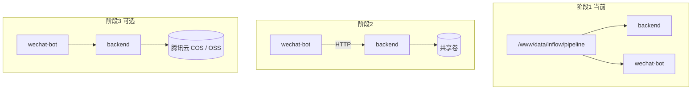

# Pipeline 存储架构与实施路线

> 环境：腾讯云 + 宝塔 + Docker  
> 关联文档：[DOCKER_OPS_GUIDE.md](./DOCKER_OPS_GUIDE.md)  
> 状态：阶段 1 实施中

---

## 1. 背景与问题

inFlow pipeline 会在磁盘上产生三类目录（均在容器内 `data/` 下）：

```
data/
├── 01_ingest/    # 原始抓取 JSON、音视频
├── 02_parse/     # 解析结果、ASR 转写
└── 03_display/   # 卡片 HTML / PNG
```

**曾出现的问题：**

| 现象 | 根因 |
|------|------|
| `Card PNG not found` 但 backend 里 `find` 能看到 PNG | `backend` 与 `wechat-bot` 是**两个容器**，未共享 `data` 目录 |
| 重建容器后文件消失 | 数据写在容器可写层，未 bind mount 到宿主机 |
| 宿主机 `03-src/backend/data` 为空 | compose 原先未挂载，或数据只在容器内 |

代码侧已有 `AbstractStorage` 抽象，可未来切换 COS/OSS；当前生产仍使用 `LocalStorage`（本地盘）。

---

## 2. 目标架构（三阶段）



| 阶段 | 目标 | 复杂度 | 周期 |
|------|------|--------|------|
| **1** | 存储与容器解耦：宿主机独立目录 + backend/wechat-bot 共享挂载 | 低 | 本周 |
| **2** | 访问解耦：wechat-bot 经 backend 内部 API 取 PNG，不再直读盘 | 中 | 1～2 月 |
| **3** | 对象存储：实现 `CosStorage`，DB 存 object key | 高 | 按需 |

---

## 3. 阶段 1：存储与容器解耦（实施中）

### 3.1 目录规划（生产服务器）

```
/www/data/inflow/
├── pipeline/     # ← bind mount 到容器 /app/data（主数据）
└── backup/       # ← 可选：pipeline 打包备份（与 pg_dump 并列）
```

**为何不用 `03-src/backend/data`：**

- 与 Git 代码目录分离，部署解压不会碰到数据
- 宝塔计划任务、磁盘监控更直观
- 权限与容量单独管理

**本地 / Mac Docker 开发：** 仍用项目内 `./03-src/backend/data`（通过 `.env` 默认值）。

### 3.2 配置方式

项目根 `.env`：

```env
# 宿主机 pipeline 目录 → 容器 /app/data
# 本地默认：./03-src/backend/data
# 宝塔生产：/www/data/inflow/pipeline
INFLOW_PIPELINE_DATA_DIR=/www/data/inflow/pipeline
```

`docker-compose.yml` 使用：

```yaml
- ${INFLOW_PIPELINE_DATA_DIR:-./03-src/backend/data}:/app/data
```

`backend` 与 `wechat-bot` **必须使用同一路径**。

### 3.3 服务器实施步骤（首次迁移）

在服务器项目根 `/www/wwwroot/inflow-ai` 执行：

```bash
cd /www/wwwroot/inflow-ai
COMPOSE="docker compose -f docker-compose.yml -f docker-compose.baota.yml"

# ① 创建宿主机目录
sudo mkdir -p /www/data/inflow/pipeline /www/data/inflow/backup
sudo chown -R "$(whoami):$(whoami)" /www/data/inflow

# ② 从旧容器拷贝已有 data（若 backend 仍在跑且里面有数据）
./migrate-pipeline-data.sh

# ③ 写入 .env（若尚未配置）
grep -q '^INFLOW_PIPELINE_DATA_DIR=' .env || \
  echo 'INFLOW_PIPELINE_DATA_DIR=/www/data/inflow/pipeline' >> .env
# 或 vi .env 手动改为上述值

# ④ 重建 backend + wechat-bot
./start-docker.sh --restart --detach

# ⑤ 验证两容器看到同一份 PNG
$COMPOSE exec backend  find data/03_display -name '*.png' | wc -l
$COMPOSE exec wechat-bot find data/03_display -name '*.png' | wc -l
# 两数字应相等且 > 0（若已有收藏）

# ⑥ 重推失败的微信回调（按需替换 job_id）
$COMPOSE exec -T postgres psql -U inflow -d inflow -c "
UPDATE wechat_callback_queue
SET status='ready', error=NULL
WHERE status='failed' AND error LIKE '%Card PNG%';"
```

### 3.4 日常备份（宝塔计划任务示例）

每日凌晨备份 pipeline + 数据库：

```bash
mkdir -p /www/data/inflow/backup
cd /www/wwwroot/inflow-ai

# 数据库
docker compose -f docker-compose.yml -f docker-compose.baota.yml exec -T postgres \
  pg_dump -U inflow inflow > /www/data/inflow/backup/inflow_$(date +\%Y\%m\%d).sql

# pipeline 文件（增量友好：按日打包）
tar czf /www/data/inflow/backup/pipeline_$(date +\%Y\%m\%d).tar.gz -C /www/data/inflow pipeline

# 保留 7 天
find /www/data/inflow/backup -name 'pipeline_*.tar.gz' -mtime +7 -delete
find /www/data/inflow/backup -name 'inflow_*.sql' -mtime +7 -delete
```

### 3.5 验收标准

- [ ] `INFLOW_PIPELINE_DATA_DIR` 在服务器 `.env` 中为 `/www/data/inflow/pipeline`
- [ ] `backend` / `wechat-bot` 内 `find data/03_display -name '*.png' | wc -l` 结果一致
- [ ] 微信收藏后 bot 日志出现「推送成功」，无 `Card PNG not found`
- [ ] `docker compose restart backend` 后 PNG 仍在（宿主机目录可查）

---

## 4. 阶段 2：访问方式解耦（规划）

**动机：** 即使取消共享卷，wechat-bot 也能推送；为多副本 backend 做准备。

**方案：** 新增内部 API（需 service token）：

```
GET /api/internal/wechat/jobs/{job_id}/card.png
Authorization: Bearer {SERVICE_TOKEN_WECHAT_BOT}
```

- backend 通过 `AbstractStorage` / `read_bytes` 读 PNG 返回
- wechat-bot 删除 `Path(png_path).is_file()` 直读逻辑
- 共享卷可保留（backend 写盘），bot 不再依赖同盘

**待改文件（预估）：**

- `app/routers/internal_wechat.py`（新建）
- `app/extensions/wechat/bot.py` — `_process_ready_callbacks`
- `app/core/shared/storage/base.py` — 增加 `read_bytes` / `exists`

---

## 5. 阶段 3：对象存储（规划）

**适用时机：** 磁盘 > 100GB、需多机扩展、要做异地灾备。

**实现要点：**

1. 新增 `CosStorage` / `OssStorage`，实现 `AbstractStorage`
2. `.env`：`STORAGE_BACKEND=local|cos`
3. DB 中 `raw_file_path` 等字段逐步改为 **object key**（非绝对路径）
4. wechat-bot 仅走阶段 2 内部 API

| 数据类型 | 建议存储 |
|----------|----------|
| 元数据 | PostgreSQL |
| JSON / PNG | COS/OSS |
| 大媒体 mp3/mp4 | COS/OSS 或本地 + 定期归档 |
| Tingwu 临时音频 | 已有独立 OSS Bucket |

---

## 6. 方案对比

| 方案 | 复杂度 | 单机宝塔 | 多副本 / K8s |
|------|--------|----------|--------------|
| 容器内 `/app/data` | 低 | ❌ | ❌ |
| 共享 bind mount（阶段 1） | 低 | ✅ 推荐 | ⚠️ 需共享 NAS |
| Named Docker Volume | 低 | ✅ | ⚠️ 备份需导出 |
| 内部 API（阶段 2） | 中 | ✅ | ✅ |
| 全量 COS（阶段 3） | 高 | ✅ | ✅ |

---

## 7. 变更记录

| 日期 | 内容 |
|------|------|
| 2026-07-02 | 初稿；阶段 1：`INFLOW_PIPELINE_DATA_DIR` + `migrate-pipeline-data.sh` |
